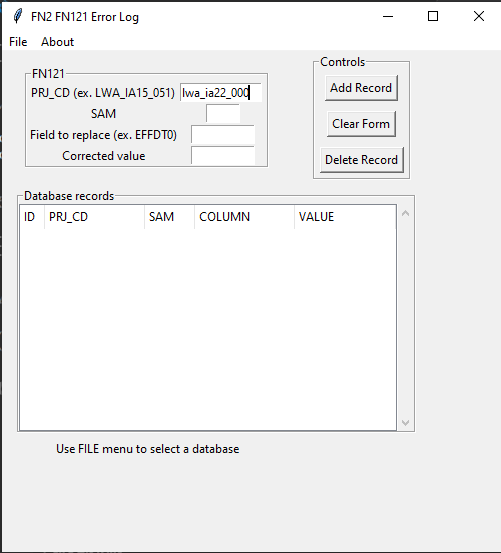
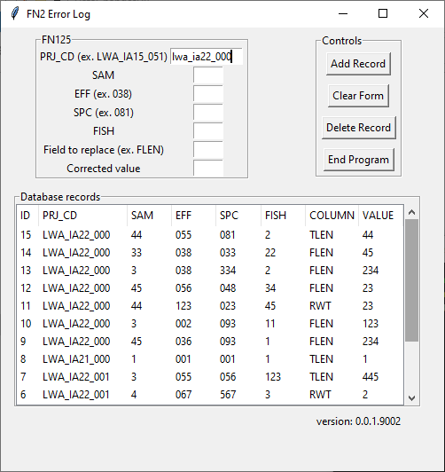

# Data Change Log Database GUI
Author: Jeremy Holden  
Email: jeremy.holden@ontario.ca  
version: 0.0.1.9004  
version date: October 19, 2022  
updated on: Aug 28, 2023 (J. Holden)

# Objective
Create a lightweight sqlite data base with a tkinter GUI that is used to record required data changes to FN2 files. Changes are recorded in the data base and then in R a `rows_update()` applies the changes to the data along with additional cleaning and standardization routines. Changes are recorded in the database and will later be merged using R along with additional cleaning and standardization routines as the data are migrated to a long term storage system. In this manner, raw data can remain unchanged while creating a documented, reproducible pipeline of data changes. 

## FN121 GUI

## FN125 GUI


# Usage
The script (executable if created) can be deployed from any directory. On load, you can create a new database or load an existing database from options in the File menu. You can move between entry boxes using "TAB". New records are added to the database via the "Submit" button (on click or with "ENTER" when highlighted). Currently, errors can only be deleted and not edited (at least not from this GUI - see DBBrowser software to interact with update_data.db if required). To delete a record, highlight the record in the spreadsheet window that is intended to be deleted and then click "Delete".  

## Running from terminal
```
python DataChangeGUI.py
```
## Executable
An executable can be created using *auto-py-to-exe*.
```
auto-py-to-exe
```


# Issues and Features
1. Current template only for FN125 - consider implementation for other tables
2. Add additional checks for field constraints (eg. `entry` in "flen", "tlen", ...))
3. FN123 GUI required

# Version Changes
### v0.0.1.9004  
1. Adds a FN121 GUI that will add a FN121Changes table to an existing database that may have only previously had FN125 changes.
2. Modifies code in FN125 to create a new table if required when connecting to an existing database (i.e. one created from FN121 GUI)
